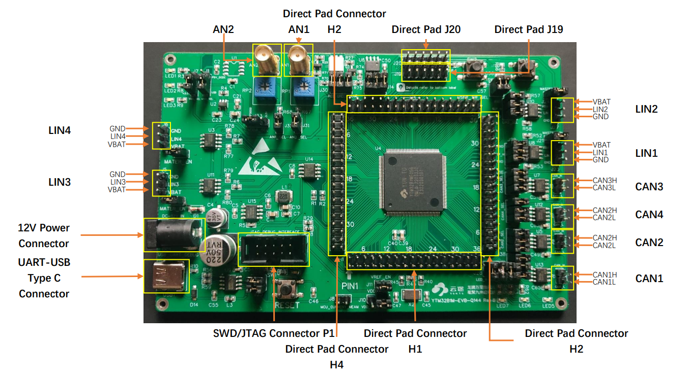
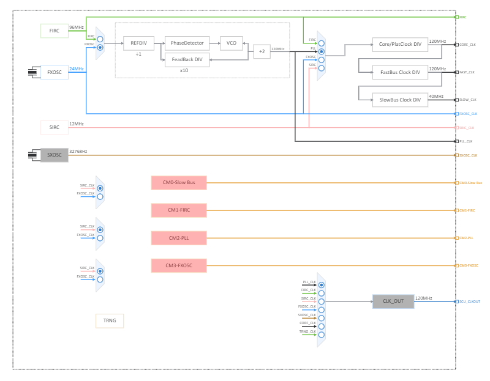
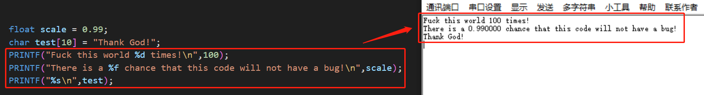
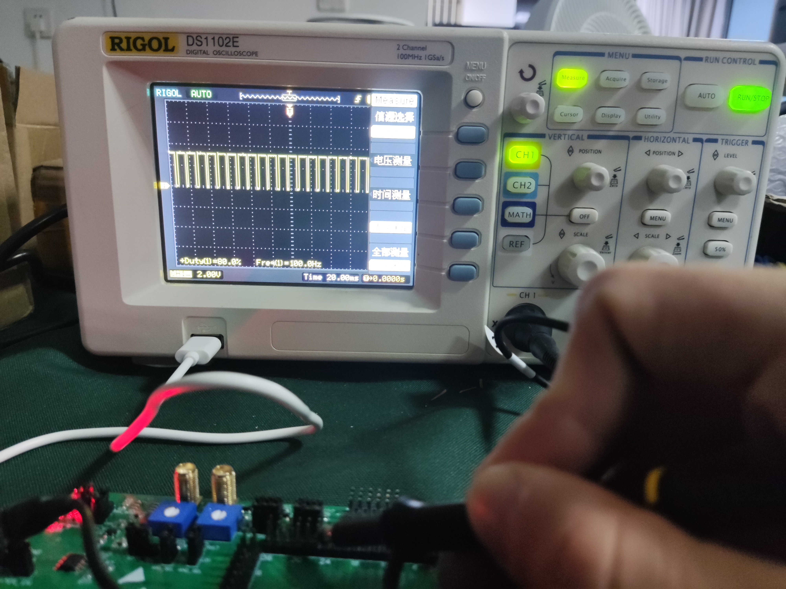
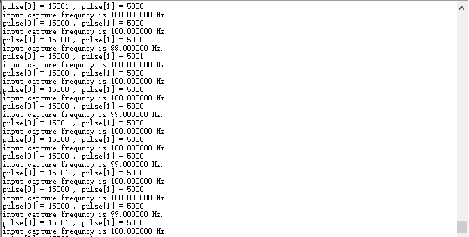
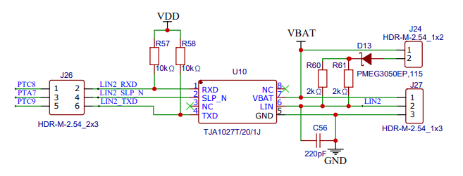
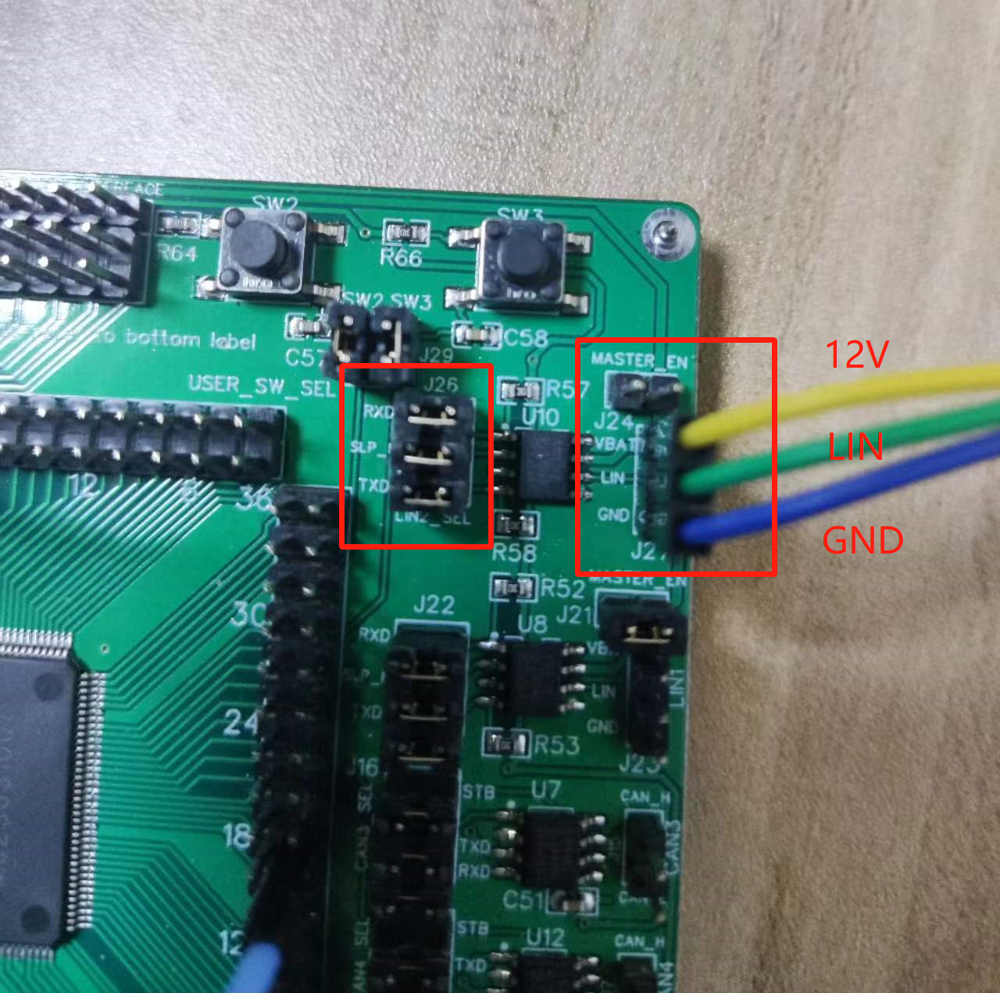
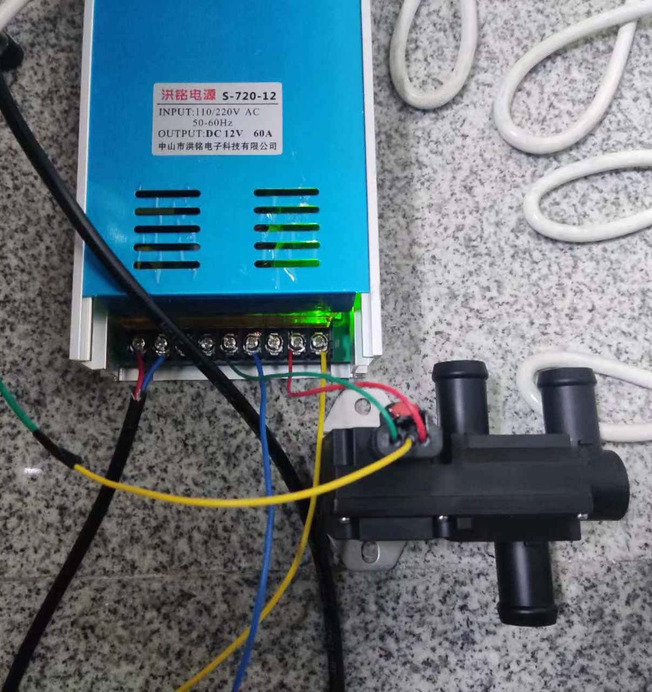
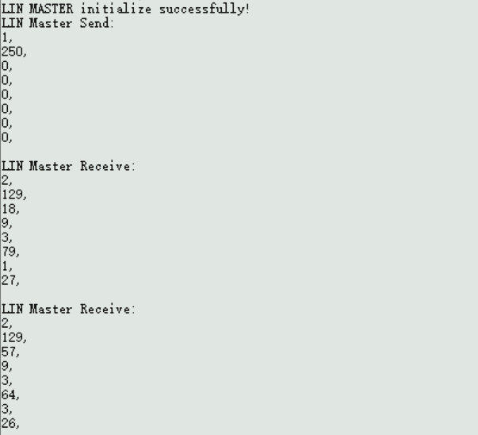

# 电动汽车整车热管理台架电控系统开发
## 项目背景

针对课题组的课题`基于R290冷媒热泵的电动汽车整车热管理系统研究`设计了一套的实验台架，该项目用于搭建适配该实验台架的电控系统，以实现实验台架的正常运行和数据采集。

## 项目需求

1. 传感器数据采集；
2. 执行器动作；
3. 采集数据的发送；
4. 部件间的通讯；


## 解决方案

### 硬件设计

主控芯片使用 **国产车规级芯片 云途 `YTM32B1ME0` **。

暂时使用云途公司的评估板 **`YTM32B1ME0 -Q144 评估板`**进行功能的开发。



#### 评估板资源

板载资源：

- EVB MCU：YTM32B1ME0-LQFP144 
- EVB 供电：12V/USB-5V 可选
- MCU 供电：5V/3.3V 可选
- 6 通道板载 LED 控制
- 2 通道按键输入 
- 4 通道 CAN 通讯接口 
- 4 通道 LIN 通讯接口 
- 2 通道电位计/模拟量输入 
- 1 个板载 I2C 接口 EEPROM 
- 1 个板载 SPI 接口 FRAM


#### 传感器

##### 流量传感器


##### 水路PT传感器


#### 执行器

##### 水泵


### 软件设计

开发初版使用云途公司提供的配置工具PE进行快速搭建。


#### MCU功能配置

##### 时钟

暂时使用默认时钟配置，外部高速晶振提供三个主时钟频率（CORE_CLK、FAST_CLK、SLOW_CLK）分别为120MHz、120MHz、40MHz。




##### 串口

串口配置：

|   功能   |  IO   | MCU  Pin  NO. | Direction | Interrupt config | Interrupt Status |
| :------: | :---: | :-----------: | :-------: | :--------------: | :--------------: |
| UART-RXD | PTA_8 |      144      |   Input   |        -         |        -         |
| UART-TXD | PTA_9 |      143      |  Output   |        -         |        -         |

- 波特率：115200
- 无奇偶校验
- 停止位：1
- 字长：8
- 传输类型：中断传输


###### 串口功能函数

`/app/UART`

实现功能：

- 串口初始化
- printf库移植，实现串口输出


###### printf函数移植

为了优化调试和数据串口输出的目的，移植了**[mpaland大佬的printf库](https://github.com/mpaland/printf)**，实现了线程安全的类PC端的输出效果。




##### PWM

使用高级定时器eTMR1，并通过channel6输出PWM。

下面是计算：
$$
快速总线时钟频率：f_{FAST\_BUS\_CLK} = \frac{f_{SYS\_CLK}}{CORE\_DIV*FBUS\_DIV} = 120MHz
$$

$$
eTMR所用时钟频率：f_{eTMR\_CLK} = \frac{f_{FAST\_BUS\_CLK}}{Prescaler}
$$

$$
PWM输出频率：f_{PWM\_FREQUENCY} = \frac{f_{eTMR\_CLK}}{(MOD + 1)}
$$

$$
PWM 对应的 eTMR 计数器周期值：Period = MOD+1
$$

根据水泵说明书要求的：**水泵的PWM信号频率额定值为100Hz。设置分频Prescaler为120，则$ f_{eTMR\_CLK}$为1MHz，产生100Hz的PWM波所对应的eTMR计数器周期值Period为10000，对应的计数器周期值MOD为9999。**这个大小小于int16的值（16位eTMR只用15位计时32767），是可以使用的。


PWM配置：

|    功能    |  IO   | MCU  Pin  NO. | eTMRx_CHx | Frequency |       CLK_SRC        | Prescaler |   Align_Mode    |
| :--------: | :---: | :-----------: | :-------: | :-------: | :------------------: | :-------: | :-------------: |
| PWM output | PTC_0 |      53       | eTMR1_CH6 |   100Hz   | $f_{FAST\_BUS\_CLK}$ |    60     | right(向上计数) |


###### PWM功能函数

`/app/PWM`

实现功能：

- PWM初始化
- PWM使能输出
- PWM失能输出
- PWM占空比调节

在`PWM.c`中主要定义的函数：

```c
void PWM_init()
{	// 调用eTMR驱动，严格意义上来讲，这个函数应该定义为eTMR_init()
    eTMR_DRV_Deinit(eTMR_INST);// 清除寄存器的值，恢复默认
    eTMR_DRV_Init(eTMR_INST,ETMR_PWM_USER_CONFIG_info,&etmrState);
    // 使用ETMR_PWM_USER_CONFIG_info结构体中的信息（时钟源、分频系数等）初始化eTMR，并把该实例的状态存到etmrState，有实例状态指针数组会指向etmrState。
    eTMR_DRV_InitPwm(eTMR_INST,&ETMR_PWM_Config0);
    // 使用ETMR_PWM_Config0结构体中的信息（频率、计数方式、技术初始值、通道具体配置（占空比等））初始化PWM mode。初始占空比配置为50%。
}

// PWM使能，发送信号
void PWM_Start()
{
    eTMR_DRV_Enable(eTMR_INST);
}

// PWM失能，停止发送信号
void PWM_Stop(void)
{
    eTMR_DRV_Disable(eTMR_INST);
}

// PWM占空比调节，输入浮点数的占空比即可
void PWM_Changedutycycle(float duty_cycle)
{
    eTMR_DRV_UpdatePwmChannel(eTMR_INST, ETMR_PWM_Config0IndChConfig[0].hwChannelId, (uint32_t)(duty_cycle * 0x8000), 0x0000U);
    eTMR_DRV_SetLdok(eTMR_INST);
    // OSIF_TimeDelay(10);
}

```


示波器显示结果：




##### 输入捕获

为完成脉冲捕获，使用eTMR0的channel0配置了输入捕获功能。其中对于定时器的时钟计算方法同[PWM配置](#####PWM)中描述的。计算捕获周期的方法为：

$$T_{Capture_Period} = Captured\_Counter * T_{eTMR\_ticks} = Captured\_Counter * \frac{1}{f_{eTMR\_CLK}}$$

其中：

$$Captured\_Counter$$是相邻的两个CH_CVAL寄存器相减得到的。

在云途给出的官方SDK中没有给出计算$$Captured\_Counter$$的库函数，但是有直接读取CH_CVAL寄存器的库函数，具体的使用可以查看下面的方法。

输入捕获配置：

|     功能      |   IO   | MCU  Pin  NO. | Direction | eTMRx_CHx |       CLK_SRC        | Prescaler |   Align_Mode   |
| :-----------: | :----: | :-----------: | :-------: | :-------: | :------------------: | :-------: | :------------: |
| Input capture | PTB_12 |      98       |   Input   | eTMR0_CH0 | $f_{FAST\_BUS\_CLK}$ |    60     | DUAL(双边捕获) |


需要注意的是：新版的SDK中通过`eTMR_SetCounterInitValSrc(etmrBase, true);`函数来确定Counter初始值的源值是从INIT寄存器中获得还是直接向CNT寄存器中写入；通过`eTMR_SetInitVal(etmrBase, 1U);`函数向INIT寄存器中写入初始值；通过`eTMR_SetMod(etmrBase, param->countValue);`函数向MOD寄存器中写入最大重装载值，对于eTMR0而言，MOD的值不可以超过0xFFFF。**具体的配置查看寄存器手册。**


###### 输入捕获功能函数

`/app/Input_capture`

实现功能：

- 输入捕获初始化
- 输入捕获使能输出
- 输入捕获失能输出
- 输入捕获脉冲频率输出

在`Input_capture.c`中主要定义的函数：

```c
// 输入捕获初始化
void Input_capture_init(void)
{
    eTMR_DRV_Deinit(eTMR_IC_INST);
    eTMR_DRV_Init(eTMR_IC_INST,&ETMR_IC_USER_CONFIG_info,&etmrState_IC);
    eTMR_DRV_InitInputCapture(eTMR_IC_INST, &ETMR_IC_Config0);
}

// 输入捕获使能
void Input_capture_Start(void)
{
    eTMR_DRV_Enable(eTMR_IC_INST);
    // eTMR_DRV_EnableChnInt(eTMR_IC_INST, ETMR_IC_Config0.inputChConfig[0].hwChannelId);
}

// 输入捕获失能
void Input_capture_Stop(void)
{
    eTMR_DRV_Disable(eTMR_IC_INST);
}

void Input_capture_get_pulse_frequncy(float *frequency)
{
    uint32_t pulse[2] = {0,0};
    // status_t status = STATUS_SUCCESS;
    while(1) // 如果没有两个边沿没有捕获完成就一直在这里等待捕获完成
    {
        eTMR_DRV_InputCaptureHandler(eTMR_IC_INST,0);// 主动调用函数，如果捕获完成会把捕获完成标志位置1，在该函数中计算了脉宽！
        if(eTMR_DRV_GetInputCaptureComplete(eTMR_IC_INST,0))// 检查捕获完成标志位是否置1
        {
            pulse[0] = eTMR_DRV_GetInputCapturePositivePulseCount(eTMR_IC_INST, 0);
            // 获取正脉宽
            pulse[1] = eTMR_DRV_GetInputCaptureNegativePulseCount(eTMR_IC_INST, 0);
            // 获取负脉宽
            eTMR_DRV_ClearInputCaptureComplete(eTMR_IC_INST,0);
            // 清楚标志位
            break;
        }
    }
    
    *frequency = eTMR_DRV_GetFrequency(eTMR_IC_INST) / (pulse[1] + pulse[0]);
    // 计算捕获的频率，并保存在外部传入的指针地址，给外部使用
    PRINTF("input capture frequncy is %f Hz.\n",*frequency);
    PRINTF("pulse[0] = %d , pulse[1] = %d \n",pulse[0],pulse[1]);
}
```

其中很踩坑的一点是：**`eTMR_DRV_InputCaptureHandler(eTMR_IC_INST,0);`中计算的是脉宽，这就意味着，输入捕获的触发信号必须是正负边沿都要触发，否则是没有办法计算的！！**由于官方SDK写得很拉跨，这里我debug了很久，并且查了很久的寄存器手册才发现问题。当然，也可以单纯捕获上升沿，通过直接读取寄存器的方法，即获取通道的CH_CVAL寄存器，然后相减得到整个脉冲的长度，但是这种需要做在中断里，目前使用的这种方法是不需要进入中断的。


将板子上的PWM输出直接接到输入捕获引脚上，计算得到的结果通过串口输出结果如下：



如图能够正确获取频率，同时可以通过`pulse[0]`和`pulse[1]`的结果计算占空比、脉冲宽度等。


##### LIN通讯

台架上的大部分元件与下位机间的通讯方式是LIN通讯，故而在MCU中配置LIN通讯功能。值得注意的是，YTM32B1ME0芯片中继承了6个片上外设LINflex，外界LIN收发器可以快速配置LIN通讯功能，加快了开发。


LIN配置：

|   功能   |                      IO                       |   MCU  Pin  NO.    |           Direction           |     CLK_SRC     |
| :------: | :-------------------------------------------: | :----------------: | :---------------------------: | :-------------: |
| LINflex1 | PTC_8(RX)<br />PTC_9(TX)<br />PTA_7(SLEEP_EN) | 81<br />80<br />83 | Input<br />Output<br />Output | $f_{CORE\_CLK}$ |


需要注意的是：在硬件板子上有两种连接方式，当板子使用5V供电时，连接 J27 (1-12V、2-LIN、3-GND)，当使用12V供电时，跳线帽直接连接 J24 ，只需要连接 J27- 2 即可。当然，J26 是要对应连接的。




实际对应板子上的接线图如下：




###### LIN功能函数

`/app/LIN`

实现功能：

- LIN主机 初始化
- LIN主机 发送帧
- LIN主机 接收帧

在`LIN.c`中主要定义的函数：

```c
// LIN主机 发送帧
void LIN_Master_Send_Frame()
{
    status_t status = STATUS_SUCCESS;
    currentEvent = 0;
    /* LIN Master Send a Frame */
    linMasterFrame.id = 0x35;
    linMasterFrame.responseType = LIN_MASTER_RESPONSE;
    status |= LINFlexD_DRV_MasterTransfer(LINFlexD_Master, &linMasterFrame);
    /* Wait until master transmission completed */
    while (0 == currentEvent);

    if (LINMasterSendDone == currentEvent)
    {
        PRINTF("LIN Master Send: \n");
        for (uint8_t i = 0; i < linMasterFrame.dataLength; i++)
        {
            PRINTF("%d, \n", linMasterFrame.data[i]);
        }
        PRINTF("\r\n");
    }
    else
    {
        PRINTF("LIN Master Send error!\n");
    }
}

// LIN主机 接收帧
void LIN_Master_Receive_Frame()
{
    status_t status = STATUS_SUCCESS;
    currentEvent = 0;
    /* LIN Master receive a Frame */
    linMasterFrame.id = 0x32;
    linMasterFrame.responseType = LIN_SLAVE_RESPONSE;
    status |= LINFlexD_DRV_MasterTransfer(LINFlexD_Master, &linMasterFrame);
    /* wait until master receive completed */
    while (0 == currentEvent);

    if (LINMaserRecvDone == currentEvent)
    {
        PRINTF("LIN Master Receive: \n");
        for (uint8_t i = 0; i < linMasterFrame.dataLength; i++)
        {
            PRINTF("%d, \n", linMasterFrame.data[i]);
        }
        PRINTF("\r\n");
    }
    else
    {
        PRINTF("LIN Master Receive error!\n");
    }
}
```

其中对于接收的处理和事件的处理结果都放在了回调函数`linflexd_process_callback`中，这个函数比较精髓，同样定义在了[`LIN.c`](.\Vehicle-thermal-management\app\LIN\LIN.c)中。


测试功能使用的是 12V供电的三通阀，搭配220V-12V DC电源转换器，进行通讯：



串口输出结果：

发送的是使控制三通阀开度调整的帧，收到的是三通阀传来的数据结果。根据商家给出的通讯矩阵可以对收到的数据进行解析。




##### FreeRTOS移植

为满足板子的实时性需求，为芯片移植了FreeRTOS操作系统（`FreeRTOS Kernel V10.4.3`）。主要文件存放在rtos文件夹中，内存管理使用了heap_4.c。`FreeRTOSConfig.h`参考了FreeRTOS官方给出的文件进行了修改。

使用动态内存创建任务的方法，在main.c文件中简单地创建了一个任务（AppTaskCreate），再在这个任务中创建两个任务进行测试：

1. PWM的开启
2. 输入捕获功能的开启

经测试，移植成功，可以正常启动。


#### 编译与烧录

使用 VS Code 进行代码编辑，Cmake构建项目，JTAG接口烧录。

在 VS Code 中进行debug。

