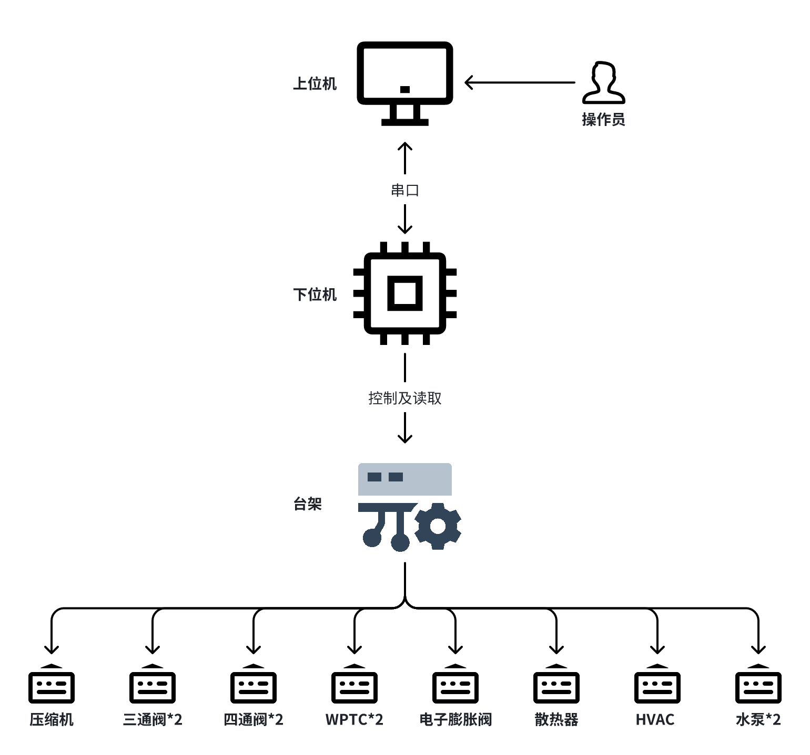

# 电动汽车整车热管理台架电控系统开发
## 项目背景

针对课题组的课题`基于R290冷媒热泵的电动汽车整车热管理系统研究`设计了一套的实验台架，该项目用于搭建适配该实验台架的电控系统，以实现实验台架的正常运行和数据采集。

## 项目需求

1. 实现对实验台架的控制；
2. 采集各控制部件的数据；
3. 开发下位机，保证实时性；
4. 开发上位机实现操作员的控制；


[TOC]

## 解决方案

### 方案概况

​		基于新型制冷剂R290的热管理台架系统控制由PC端的上位机与MCU端的下位机组合完成，实现对台架上压缩机、三通阀等元件的控制与数据读取。台架控制方案的示意图见图。

​		其中，下位机根据对应的**LIN通讯**协议对LIN通讯元件进行控制，并输出PWM波调节水泵、散热器风扇等元件的转速。下位机同时循环读取各元件的状态，与上位机**通过串口通信**，上位机在获取数据后通过解析显示。操作员通过观察和操作上位机向下位机发送指令实现对台架的控制。



​		实验台架由系统部分和电源信号箱部分组成：


|  |  |
| :----------------------------------------------------------: | :----------------------------------------------------------: |
|                          电源信号箱                          |                           台架部件                           |


### 下位机方案

#### 硬件设计

主控芯片使用 **国产车规级芯片 云途 `YTM32B1ME0` **。

暂时使用云途公司的评估板 **`YTM32B1ME0 -Q144 评估板`**进行功能的开发。


##### 片上资源与开发板资源

片上资源如下所示

板载资源：

- EVB MCU：YTM32B1ME0-LQFP144 
- EVB 供电：12V/USB-5V 可选
- MCU 供电：5V/3.3V 可选
- 6 通道板载 LED 控制
- 2 通道按键输入 
- 4 通道 CAN 通讯接口 
- 4 通道 LIN 通讯接口 
- 2 通道电位计/模拟量输入 
- 1 个板载 I2C 接口 EEPROM 
- 1 个板载 SPI 接口 FRAM

|  |  |
| :-----------------------: | :------------------------------------------------------: |
|         片上资源          |                        开发板资源                        |


#### 软件设计

​		MCU配置通过云途公司提供的配置工具YT CONFIG TOOL。通过该工具对MCU的资源进行基础配置。

​		使用 **Visual Studio Code** 进行代码编辑，**CMake构建项目**，**JTAG接口烧录**。在 VS Code 中进行Debug。

|  |  |
| :-----------------: | :---------------------------------------------------: |
|   YT CONFIG TOOL    |                   VS Code 编写代码                    |

使用的开发板及 J-Link 烧录器：


|  |  |
| :---------------------: | :-------------------------: |
|         开发板          |           J-link            |

##### MCU功能配置

###### 时钟

使用默认时钟配置，外部高速晶振提供三个主时钟频率（CORE_CLK、FAST_CLK、SLOW_CLK）分别为120MHz、120MHz、40MHz。经过分频器、锁相环等后MCU主频为120MHz。


###### 串口

| **功能** | **IO** | **MCU Pin NO.** | **Direction** | **Interrupt config** | **Interrupt Status** |
| -------- | ------ | --------------- | ------------- | -------------------- | -------------------- |
| UART-RXD | PTA_8  | 144             | Input         | 接收中断+空闲中断    | No clear             |
| UART-TXD | PTA_9  | 143             | Output        | 发送中断             | clear                |


- 波特率：115200 bit/s
- 无奇偶校验
- 停止位：1
- 字长：8
- 传输类型：中断传输
- 接收方式：环形缓冲区


`/app/UART`

实现功能：

- 串口初始化
- printf库移植，实现串口输出
- 实现环形缓冲区，避免再高速传输过程中的数据丢包现象


###### printf函数移植

​		为了优化调试和数据串口输出的目的，移植了**[mpaland大佬的printf库](https://github.com/mpaland/printf)**，实现了线程安全的类PC端的输出效果。


​		串口接收数据的方式使用 **接收中断+空闲中断** 实现，使用接收中断获取单字节数据并**存入环形缓冲区**中，在空闲中断中向主任务发送信号量表明传输结束。

```c
/* 以下定义和声明在 UART.h 中 */

/* 环形缓冲区结构体 */
typedef struct
{
    uint8_t head;                 // 缓冲区头部位置
    uint8_t tail;                 // 缓冲区尾部位置
    uint8_t ringBuff[BUFFER_MAX]; // 缓冲区数组
} ringBuffer_t;

/* 缓冲区写单字节 */
void RingBuff_Write(uint8_t data);
/* 缓冲区读数据帧，存放在全局变量中 */
uint8_t RingBuff_Read_frame(void);
/* 缓冲区读单字节 */
void RingBuff_Read_Byte(uint8_t *pData);
```


###### 定时器

使用高级定时器eTMR1，并通过channel6输出PWM。

下面是计算：
$$
快速总线时钟频率：f_{FAST\_BUS\_CLK} = \frac{f_{SYS\_CLK}}{CORE\_DIV*FBUS\_DIV} = 120MHz
$$

$$
eTMR所用时钟频率：f_{eTMR\_CLK} = \frac{f_{FAST\_BUS\_CLK}}{Prescaler}
$$

$$
PWM输出频率：f_{PWM\_FREQUENCY} = \frac{f_{eTMR\_CLK}}{(MOD + 1)}
$$

$$
PWM 对应的 eTMR 计数器周期值：Period = MOD+1
$$

根据水泵说明书要求的：**水泵的PWM信号频率额定值为100Hz。设置分频Prescaler为120，则$ f_{eTMR\_CLK}$为1MHz，产生100Hz的PWM波所对应的eTMR计数器周期值Period为10000，对应的计数器周期值MOD为9999。**这个大小小于int16的值（16位eTMR只用15位计时32767），是可以使用的。


PWM配置：

四路PWM的频率相同，直接使用一个定时器eTMR1的四个通道即可：

|    功能    |  IO   | MCU  Pin  NO. | eTMRx_CHx | Frequency |       CLK_SRC        | Prescaler |   Align_Mode    |
| :--------: | :---: | :-----------: | :-------: | :-------: | :------------------: | :-------: | :-------------: |
| PWM 水泵2  | PTC_0 |      53       | eTMR1_CH6 |   100Hz   | $f_{FAST\_BUS\_CLK}$ |    60     | right(向上计数) |
| PWM 水泵1  | PTC_1 |      52       | eTMR1_CH7 |   100Hz   | $f_{FAST\_BUS\_CLK}$ |    60     | right(向上计数) |
|  PWM HVAC  | PTD_8 |      55       | eTMR1_CH5 |   100Hz   | $f_{FAST\_BUS\_CLK}$ |    60     | right(向上计数) |
| PWM 散热器 | PTD_9 |      54       | eTMR1_CH4 |   100Hz   | $f_{FAST\_BUS\_CLK}$ |    60     | right(向上计数) |


`/app/PWM`

实现功能：

- PWM初始化
- PWM使能输出
- PWM失能输出
- PWM占空比调节

```c
/* 以下定义和声明在 PWM.h 中 */

// PWM 初始化
void PWM_init(void);
// PWM使能，发送信号
void PWM_Start(void);
// PWM失能，停止发送信号
void PWM_Stop(void);
// PWM占空比调节
void PWM_Changedutycycle(float duty_cycle);
```


示波器显示结果：


###### 输入捕获

为完成脉冲捕获，使用eTMR0的channel0配置了输入捕获功能。其中对于定时器的时钟计算方法同[PWM配置](#####PWM)中描述的。计算捕获周期的方法为：

$$T_{Capture_Period} = Captured\_Counter * T_{eTMR\_ticks} = Captured\_Counter * \frac{1}{f_{eTMR\_CLK}}$$

其中：

$$Captured\_Counter$$是相邻的两个CH_CVAL寄存器相减得到的。

在云途给出的官方SDK中没有给出计算$$Captured\_Counter$$的库函数，但是有直接读取CH_CVAL寄存器的库函数，具体的使用可以查看下面的方法。

输入捕获配置：

|     功能      |   IO   | MCU  Pin  NO. | Direction | eTMRx_CHx |       CLK_SRC        | Prescaler |   Align_Mode   |
| :-----------: | :----: | :-----------: | :-------: | :-------: | :------------------: | :-------: | :------------: |
| Input capture | PTB_12 |      98       |   Input   | eTMR0_CH0 | $f_{FAST\_BUS\_CLK}$ |    60     | DUAL(双边捕获) |


​		需要注意的是：新版的SDK中通过`eTMR_SetCounterInitValSrc(etmrBase, true);`函数来确定Counter初始值的源值是从INIT寄存器中获得还是直接向CNT寄存器中写入；通过`eTMR_SetInitVal(etmrBase, 1U);`函数向INIT寄存器中写入初始值；通过`eTMR_SetMod(etmrBase, param->countValue);`函数向MOD寄存器中写入最大重装载值，对于eTMR0而言，MOD的值不可以超过0xFFFF。**具体的配置查看寄存器手册。**


`/app/Input_capture`

实现功能：

- 输入捕获初始化
- 输入捕获使能输出
- 输入捕获失能输出
- 输入捕获脉冲频率输出

```c
/* 以下定义和声明在 Input_capture.h 中 */

// 输入捕获初始化
void Input_capture_init(void);
// 输入捕获使能
void Input_capture_Start(void);
// 输入捕获失能
void Input_capture_Stop(void);
// 获取输入捕获的脉冲频率
void Input_capture_get_pulse_frequncy(float *frequency);
```

其中很踩坑的一点是：**`eTMR_DRV_InputCaptureHandler(eTMR_IC_INST,0);`中计算的是脉宽，这就意味着，输入捕获的触发信号必须是正负边沿都要触发，否则是没有办法计算的！！**由于官方SDK写得很拉跨，这里我debug了很久，并且查了很久的寄存器手册才发现问题。当然，也可以单纯捕获上升沿，通过直接读取寄存器的方法，即获取通道的CH_CVAL寄存器，然后相减得到整个脉冲的长度，但是这种需要做在中断里，目前使用的这种方法是不需要进入中断的。


将板子上的PWM输出直接接到输入捕获引脚上，计算得到的结果通过串口输出结果如下：


如图能够正确获取频率，同时可以通过`pulse[0]`和`pulse[1]`的结果计算占空比、脉冲宽度等。


###### LIN通讯

​		台架上的大部分控制元件与下位机间的通讯方式是LIN通讯，故而在MCU中配置LIN通讯功能。值得注意的是，YTM32B1ME0芯片中继承了4个片上外设LINFlexd，外界LIN收发器可以快速配置LIN通讯功能，加快了开发。LINFlexD 控制器是芯片的一个 IP，支持 Local Interconnect Network (LIN) 协议，可作 LIN 主机或作 LIN 从机。


LIN配置：

|   功能   |                      IO                       |   MCU  Pin  NO.    |           Direction           |     CLK_SRC     |
| :------: | :-------------------------------------------: | :----------------: | :---------------------------: | :-------------: |
| LINflex1 | PTC_8(RX)<br />PTC_9(TX)<br />PTA_7(SLEEP_EN) | 81<br />80<br />83 | Input<br />Output<br />Output | $f_{CORE\_CLK}$ |


需要注意的是：在硬件板子上有两种连接方式，当板子使用5V供电时，连接 J27 (1-12V、2-LIN、3-GND)，当使用12V供电时，跳线帽直接连接 J24 ，只需要连接 J27- 2 即可。当然，J26 是要对应连接的。这里注意，在主机通讯时必须连接12V VBAT，否则LIN通讯很大概率会失败。

|  |  |
| :-----------------------: | :----------------------------------------------------------: |
|          原理图           |                            接线图                            |


`/app/LIN`

实现功能：

- LIN主机 初始化
- LIN主机 发送帧
- LIN主机 接收帧


```c
/* 以下定义和声明在 LIN.h 中 */

#define LIN0_Master (0)
#define LIN1_Master (1)
#define LIN2_Master (3)
#define LINMaserRecvDone (1)
#define LINMasterSendDone (2)
#define LINMasterError (3)

/*
currentEvent = 1 means master recv done,
currentEvent = 2 means master send done,
currentEvent = 3 means error happens
*/
extern volatile uint8_t currentEvent;

// LIN主机 初始化
void LIN_MASTER_init(void);
// LIN主机 发送帧
status_t LIN_Master_Send_Frame(uint32_t instance);
// LIN主机 接收帧
status_t LIN_Master_Receive_Frame(uint32_t instance);
```

其中对于接收的处理和事件的处理结果都放在了回调函数`linflexd_process_callback`中，这个函数比较精髓，同样定义在了[`LIN.c`](.\Vehicle-thermal-management\app\LIN\LIN.c)中。


###### LIN通讯的检测

测试功能使用的是 12V供电的三通阀，搭配220V-12V DC电源转换器，进行通讯：

串口输出结果：发送的是使控制三通阀开度调整的帧，收到的是三通阀传来的数据结果。根据商家给出的通讯矩阵可以对收到的数据进行解析。

|  |  |  |
| :----------------------------------------------------------: | :----------------------------------------------------------: | :-----------------------------: |
|                     三通阀LIN测试接线图                      |                     LIN总线用12V稳压电源                     |         LIN通讯串口反馈         |

|  |  |
| :------------------------------------------: | :----------------------------------------------------------: |
|                   干扰波型                   |                     修正后正常的通讯波形                     |


###### LIN总线设备挂载情况

​		由于存在两个相同的三通阀、四通阀、WPTC，为清晰区分器件，且出现三通阀与压缩机有指令帧ID是相同的情况，拉起三条LIN总线，将相同的期间分别装载在不同的总线上：


| LIN0 总线  | LIN1 总线 | LIN3 总线 |
| :--------: | :-------: | --------- |
|   压缩机   | WPTC电池  | WPTC电机  |
| 电子膨胀阀 | 三通阀#1  | 三通阀#2  |
|            | 四通阀#1  | 四通阀#2  |


###### FreeRTOS移植

​		在开发过程中为芯片移植了FreeRTOS操作系统（**FreeRTOS Kernel V10.4.3**）。源码存放在项目rtos文件夹中，内存管理使用了**heap_4.c**方式。FreeRTOSConfig.h参考了FreeRTOS官方给出的文件进行了修改。

​		任务创建使用动态内存创建方法，在main.c文件中创建了一个任务（AppTaskCreate），用于创建主程序任务。项目中的主要任务有四个：

- **Task_main**：在获取串口中断释放的信号量后对数据帧进行解析，如果满足正确的帧格式则进行解析，根据指令码将数据发送给消息队列或激活事件，唤醒对应的任务。在未收到信号量的时候阻塞任务。
- **Task_00**：在收到Task_main的事件激活时被唤醒，清除Task_02使能事件，中止Task_01的发送，中止台架的运行。未收到激活事件时被阻塞。
- **Task_01**：在收到Task_main向消息队列中写入的消息后被唤醒，对数据帧进行解包，根据数据向控制元件进行控制及调整，在发送控制数据结束后，唤醒Task_02。在消息队列中未收到消息的时候阻塞任务。
- **Task_02**：在收到Task_01的事件激活时被唤醒，获取台架的状态信息，对状态信息进行组包，通过串口向上位机发送。在被清除使能事件或未收到激活事件时被阻塞。


```c
/* 以下定义和声明在 Task.c 中 */

/* 任务句柄 */
TaskHandle_t Task_main_Handle = NULL;
TaskHandle_t Task_0x00_Handle = NULL;
TaskHandle_t Task_0x01_Handle = NULL;
TaskHandle_t Task_0x02_Handle = NULL;
```


###### 任务间的同步与通信

该操作系统中运行有四个任务，任务间的通信主要通过消息队列、互斥信号量、事件组、信号量来完成，同时为了保证资源的互斥访问，使用了互斥锁。

```c
/* 以下定义和声明在 Task.c 中 */

/* 通信用句柄 */
extern QueueHandle_t Message_queue_main2Task0x01; // 主任务向Task01通信用消息队列句柄
extern SemaphoreHandle_t Get_upper_order_Handle;  // 串口接收二值信号量
extern EventGroupHandle_t HangTask01EventGroup;   // 挂起Task01用事件组句柄
extern SemaphoreHandle_t MuxSem_Handle;           // 互斥信号量句柄，用于保护LIN传输帧
extern SemaphoreHandle_t MuxSem_Serial_Handle;    // 互斥信号量句柄，用于保护串口传输帧
```


###### 下位机的运行逻辑

​    为实现下位机与上位机的正常通信，需要对上位机和下位机的运行逻辑进行设计。下位机的运行逻辑流程图如图13所示，在FreeRTOS操作系统中运行四个任务，其中主任务与串口中断通过信号量同步，串口接收到一帧信息后通过信号量通知主任务，主任务进行解析获取指令，通过消息队列或事件组的事件激活唤醒对应的任务。唤醒的任务完成自身的主要功能并通过事件激活或阻塞其他任务。


```c
/* 以下定义和声明在 LIN_device_control.h 中 */


/************************************ 压缩机通讯 ************************************/
/* 更改压缩机的转速，变相等于开启压缩机 */
uint8_t Compressor_Set_Speed(uint16_t speed, uint16_t limit_power);
/* 关闭压缩机 */
uint8_t Compressor_Shutdown(void);
/* 获取压缩机状态 */
uint8_t Compressor_Get_info(void);
/************************************ 电子膨胀阀通讯 ************************************/
/* 更改电子膨胀阀的开度 */
uint8_t Expansion_valve_Set_Open(uint16_t open);
/* 获取电子膨胀阀状态 */
uint8_t Expansion_valve_Get_info(void);
/************************************ 三通阀通讯 ************************************/
/* 更改三通阀的比例开度 */
uint8_t Three_way_valve_Set_Open(uint8_t instance, uint8_t pos);
/* 获取比例三通阀状态 */
uint8_t Three_way_valve_Get_info(uint8_t instance);
/************************************ 四通阀通讯 ************************************/
/* 更改四通阀的开关状态 */
uint8_t Four_way_valve_Set_Open(uint8_t instance, uint8_t mode); // mode 只有两种取值
/* 获取比例三通阀状态 */
uint8_t Four_way_valve_Get_info(uint8_t instance);
/************************************ WPTC通讯 ************************************/
/* 开启WPTC加热，并设置温度 */
uint8_t WPTC_Set_Temperature(uint8_t instance, uint8_t temperature, uint8_t heat_power);
/* 获取WPTC状态 */
uint8_t WPTC_Get_info(uint8_t instance); // 输入的是第instance个WPTC，instance = 1 or 2

```


### 上位机设计

#### 上位机开发环境

上位机使用C# 开发，开发环境为Visual Studio 2022。


#### 上位机与下位机通讯数据帧定义

​		上位机与下位机传输时，由于指令需求的不同，数据帧是非定长的，故在字节流中需要判断出每一帧的起始和结束位置。

​		**串口发送帧格式规定：由 帧头 + 指令码 + 数据码 + 数据长 + 帧尾 组成。**

约束串口通信的帧头帧尾格式如下：

- 帧头：0xFE
- 帧尾：0xFF


​	上位机与下位机在通讯过程中根据该定义进行数据的组包和解包。


#### 上位机运行逻辑与界面

​		上位机的运行逻辑设计如下：不断获取串口数据进行解包，根据数据帧的定义进行解包并进行显示，刷新显示框内的内容以及图表。操作员通过点击上位机界面上的按钮向下位机发送指令，再通过观察数据框和图标得到反馈和台架的状态数据。


上位机的初版界面如下所示：

​	控制元件的所有状态在界面中实时显示，并能够通过选择框输入进行控制，下位机的调试语句和控制元件的状态数据同样也会在左边的显示框中显示。


