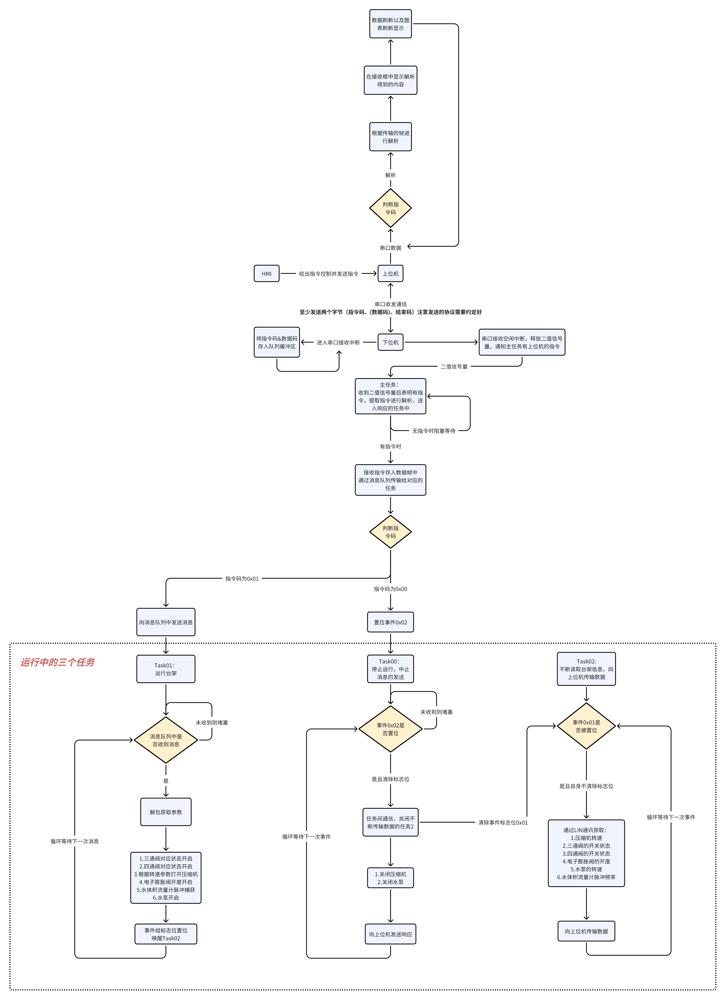

# 上位机设计与使用方法

## 上位机的设计

上位机通过串口与下位机进行通讯

### 需要的功能

- 串口扫描与波特率选择
- 串口的打开与关闭
- 串口信息的发送
- 串口信息的接收与解析
- 数据的波形绘制
- 数据的保存


## 通讯逻辑

下位机搭载FreeRTOS，主要内容为在串口中断中进行对指令码的判断，从而开启对应的任务。

### 通讯协议规定

- 串口波特率115200；
- 8个数据位；
- 无校验位；
- 1个停止位。

串口发送帧格式规定：由 **`帧头 + 指令码 + 数据码 + 帧尾`** 组成。

帧头：0x0A

帧尾：0xFF

指令码与数据码根据具体开启的任务而定。



```c
/* 定义台架的状态结构体 */
typedef struct 
{
    uint8_t three_way_valve_status; // 三通阀状态
    uint8_t four_way_valve_status; // 四通阀状态
    uint8_t compressor_status; // 压缩机开启状态
    uint16_t compressor_speed; // 压缩机转速
    uint8_t water_pump_duty; // 水泵占空比
}Workbench_status_t;

/*
	其中：
	三通阀、四通阀各两个，分别用每个阀使用4bit来标识（由于只有两种状态，其实两个bit就够了，但为了更加明了这样来设计）
	压缩机开启状态使用一个字节来传输
	压缩机转速用四个字节标识，因为在通讯矩阵中通过LIN发送的转速为2字节，放大系数为50，所以最大值为255*50 = 12750 < 65535
	水泵占空比使用一个字节传输，默认为百分比制
	
	故而传输帧格式为{0x0A（帧头）,0x（指令码）, 0x,0x,0x,0x,0x,0x, 0XFF（帧尾）}，数据码共6byte
*/

```


## 更新日志

### 2024.2.22

1. 完成串口助手的基本功能，能够与下位机进行数据的读写

### 2024.2.25

1. 完成通讯逻辑的初版设计，绘制出流程图